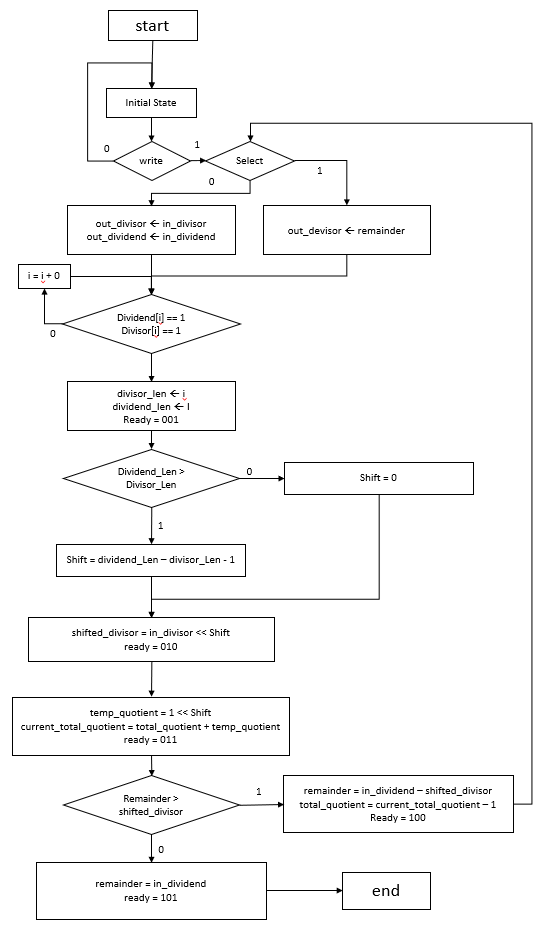
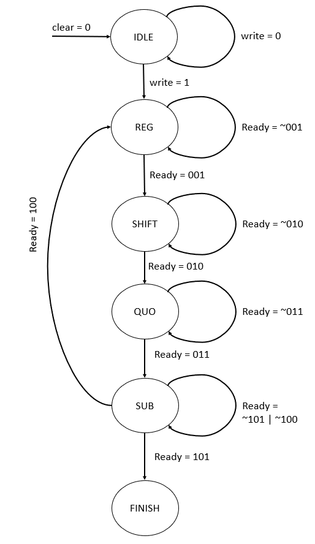
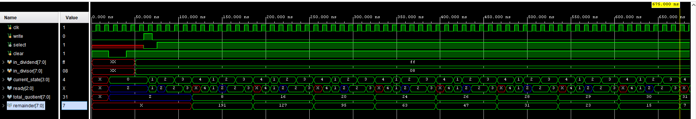

<h1>Hardware Division Unit Using Mental Arithmetic</h1>  

8 bit Dividend & 4 bit Divisor  
Board = Basys3  
Hardware Development tool = Vivado 2022.1 

Original Algorithm Idea : <a href="https://doi.org/10.1109/ICSTM.2015.7225434"> 64 bit divider using Vedic mathematics </a>

  <table>
     <tr>
       <th> ASM flow </th>
       <th> FSM flow </th>
    </tr>
    <tr>
      <td></td>
      <td></td>
  </table>
  
  <h2> Simulation </h2>
  

